# 🌌 Project Hyperion-X

> **The Operating System for AGI at Planetary Scale.**

---

## The Mission

The current landscape of large-scale AI is defined by a fragmented and inefficient scramble for compute. Teams wrestle with heterogeneous hardware across multiple clouds and on-premise data centers, leading to spiraling costs, crippling complexity, and wasted resources. Brute-force scaling is no longer a viable strategy.

**Project Hyperion-X** is the answer. It is an intelligent, self-optimizing control plane designed to unify the world's compute resources into a single, cohesive fabric. By leveraging reinforcement learning, Hyperion-X acts as an autonomous nervous system for AI infrastructure, making real-time decisions to route workloads to the most optimal location based on cost, latency, performance, and even the carbon footprint of the underlying power grid.

This project is building the foundational infrastructure required to run AGI-level workloads reliably and efficiently at a planetary scale.

## ✨ Core Features

-   🧠 **Autonomous RL-driven Orchestration:** A multi-objective reinforcement learning agent acts as the global scheduler, learning and adapting to optimize for cost, speed, and sustainability without human intervention.
-   🌍 **Planetary-Scale Hybrid Cloud:** Seamlessly manages and schedules jobs across a heterogeneous fleet of nodes spanning **AWS, GCP, Azure, on-premise HPC clusters, and edge devices**.
-   ⚡️ **Ultra-Low-Latency Preemption:** Guarantees **sub-50ms execution** for high-priority inference workloads by dynamically and intelligently pausing, checkpointing, and migrating lower-priority batch training jobs.
-   🌿 **Carbon-Aware Scheduling:** Integrates with real-time grid carbon intensity data to prioritize running workloads on renewable energy, reducing the environmental impact of large-scale AI.
-   🛡️ **Resilience & Self-Healing:** Designed to be fault-tolerant from the ground up, automatically recovering from node failures, network partitions, and even entire cloud region outages.

## 🏛️ Architecture at a Glance

Hyperion-X is built on a three-tiered architecture: the global **Federation Plane** (the brain), the regional **Cluster Plane** (the manager), and the on-machine **Node Plane** (the agent).

```mermaid
flowchart TD
    subgraph User Interaction
        User["User / API Client"]
    end

    subgraph FederationPlane["🌍 Federation Control Plane (Global Brain)"]
        direction LR
        GlobalAPI["Federation API (Go/gRPC)"]
        RLBrain["🧠 RL Brain (Python/Ray)"]
        GlobalState["etcd (Global State)"]
        GlobalAPI -- Manages --> GlobalState
        GlobalAPI -- Consults --> RLBrain
    end

    subgraph ClusterA["Cluster A (e.g., AWS us-east-1)"]
        direction TB
        SchedulerA["h-scheduler (Go)"]
        NodeA1["Node 1 (hyperiond - Rust)"]
        NodeA2["Node 2 (hyperiond - Rust)"]
        SchedulerA -- schedules --> NodeA1
        SchedulerA -- schedules --> NodeA2
    end
    
    subgraph ClusterB["Cluster B (e.g., GCP europe-west1)"]
        direction TB
        SchedulerB["h-scheduler (Go)"]
        NodeB1["Node 1 (hyperiond - Rust)"]
        NodeB2["Node 2 (hyperiond - Rust)"]
        SchedulerB -- schedules --> NodeB1
        SchedulerB -- schedules --> NodeB2
    end

    User -- "submits AIJob" --> GlobalAPI
    GlobalAPI -- "sends placement decision" --> SchedulerA
    GlobalAPI -- "sends placement decision" --> SchedulerB
    NodeA1 -- "streams metrics" --> SchedulerA
    SchedulerA -- "reports state" --> GlobalAPI
```

> For a complete breakdown, see the full [**Architectural Blueprint**](./docs/architecture.md).

## 🗺️ Project Roadmap & Status

This project is currently in the foundational research and development stage.

-   [✅] **Phase 0: Foundation & Architectural Blueprint**
-   [⏳] **Phase 1: Single-Cluster MVP** (Custom K8s Scheduler & Agent)
-   [🗓️] **Phase 2: Multi-Cloud Federation Layer**
-   [🗓️] **Phase 3: Reinforcement Learning "Brain" Integration**
-   [🗓️] **Phase 4: Edge & Advanced Capabilities** (Preemption, Carbon-Awareness)
-   [🗓️] **Phase 5: Public Release & Community Building**

## 🛠️ Technology Stack

-   **Core Systems:** **Rust** (Node Agent), **Go** (Control Plane Services)
-   **AI & Orchestration:** **Kubernetes** (Custom Schedulers), **Ray** (RLlib), **PyTorch** (FSDP), **DeepSpeed**
-   **Cloud & HPC:** AWS/GCP/Azure APIs, **Terraform**, **gRPC**, **CUDA**, **NCCL**, MPI
-   **Edge & Inference:** WebGPU, **ONNX Runtime**, **vLLM**

## 🤝 Contributing

This is a personal research project aiming to push the boundaries of AI infrastructure. Contributions, ideas, and feedback are welcome. Please see [CONTRIBUTING.md](./CONTRIBUTING.md) for more details.

## 📜 License

This project is licensed under the [Apache License 2.0](./LICENSE).
