# Project Hyperion-X: Architectural Blueprint v0.1

**Author:** Dileep Karehuchhannanavar  
**Last Updated:** August 2025  
**Status:** DRAFT  

---

## 1. Vision & Goals

### 1.1 Vision
Hyperion-X aspires to become the **planetary-scale operating system for AI** — a self-learning, autonomous orchestration platform capable of scheduling and managing **distributed AI training and inference workloads** across heterogeneous infrastructure (multi-cloud, on-prem, and edge).  

This is not merely a scheduler. It is the **control plane for AGI-level compute**, designed to operate at global scale, under adversarial conditions, with dynamic optimization for cost, latency, reliability, and sustainability.

### 1.2 Core Goals
- **Autonomous Orchestration:** Dynamically schedule workloads across **AWS, GCP, Azure, and edge nodes** with no manual intervention.  
- **Optimization via RL:** Leverage a **multi-objective Reinforcement Learning (RL) agent** to optimize for:  
  - Compute cost (spot pricing, reserved instances)  
  - Latency (cross-region/cross-cloud traffic)  
  - Data egress charges  
  - Carbon intensity of grids (sustainability-aware scheduling)  
- **Resilience & Self-Healing:** Ensure workloads continue under **node failures, preemptions, or network partitions**.  
- **Latency Guarantees:** Deliver **sub-50ms preemption** for inference workloads by dynamically pausing/rescheduling batch jobs.  
- **Developer Simplicity:** Expose a **clean API** (via gRPC/REST) where a user submits a job spec (PyTorch, JAX, or custom container) and the system “just runs it” at optimal placement.

### 1.3 Non-Goals
- Not a new container runtime. Hyperion-X builds on **Docker/CRI-O** and runs on **Kubernetes** clusters.  
- Not a new ML framework. It orchestrates jobs from **PyTorch, JAX, DeepSpeed, vLLM**, etc.  
- Not a pure HPC batch system replacement — it **integrates with Slurm/MPI** when required.  

---

```mermaid
flowchart TD
    subgraph User Interaction
        User["User / API Client"]
    end

    subgraph FederationPlane["🌍 Federation Control Plane (Global Brain)"]
        direction LR
        GlobalAPI["Federation API (Go/gRPC)"]
        RLBrain["🧠 RL Brain (Python/Ray)"]
        GlobalState["etcd (Global State)"]
        GlobalAPI -- Manages --> GlobalState
        GlobalAPI -- Consults --> RLBrain
    end

    subgraph ClusterA["Cluster A (e.g., AWS us-east-1)"]
        direction TB
        SchedulerA["h-scheduler (Go)"]
        NodeA1["Node 1 (hyperiond - Rust)"]
        NodeA2["Node 2 (hyperiond - Rust)"]
        SchedulerA -- schedules --> NodeA1
        SchedulerA -- schedules --> NodeA2
    end

    subgraph ClusterB["Cluster B (e.g., GCP europe-west1)"]
        direction TB
        SchedulerB["h-scheduler (Go)"]
        NodeB1["Node 1 (hyperiond - Rust)"]
        NodeB2["Node 2 (hyperiond - Rust)"]
        SchedulerB -- schedules --> NodeB1
        SchedulerB -- schedules --> NodeB2
    end

    User -- "submits AIJob" --> GlobalAPI
    GlobalAPI -- "sends placement decision" --> SchedulerA
    GlobalAPI -- "sends placement decision" --> SchedulerB
    NodeA1 -- "streams metrics" --> SchedulerA
    NodeA2 -- "streams metrics" --> SchedulerA
    NodeB1 -- "streams metrics" --> SchedulerB
    NodeB2 -- "streams metrics" --> SchedulerB
    SchedulerA -- "reports state" --> GlobalAPI
    SchedulerB -- "reports state" --> GlobalAPI
```

## 🗺️ Project Roadmap & Status

This project is currently in the foundational research and development stage.

-   [✅] **Phase 0: Foundation & Architectural Blueprint**
-   [⏳] **Phase 1: Single-Cluster MVP** (Custom K8s Scheduler & Agent)
-   [🗓️] **Phase 2: Multi-Cloud Federation Layer**
-   [🗓️] **Phase 3: Reinforcement Learning "Brain" Integration**
-   [🗓️] **Phase 4: Edge & Advanced Capabilities** (Preemption, Carbon-Awareness)
-   [🗓️] **Phase 5: Public Release & Community Building**

## 🛠️ Technology Stack

-   **Core Systems:** **Rust** (Node Agent), **Go** (Control Plane Services)
-   **AI & Orchestration:** **Kubernetes** (Custom Schedulers), **Ray** (RLlib), **PyTorch** (FSDP), **DeepSpeed**
-   **Cloud & HPC:** AWS/GCP/Azure APIs, **Terraform**, **gRPC**, **CUDA**, **NCCL**, MPI
-   **Edge & Inference:** WebGPU, **ONNX Runtime**, **vLLM**

## 🤝 Contributing

This is a personal research project aiming to push the boundaries of AI infrastructure. Contributions, ideas, and feedback are welcome. Please see [CONTRIBUTING.md](./CONTRIBUTING.md) for more details.

## 📜 License

This project is licensed under the [Apache License 2.0](./LICENSE).