# Project Hyperion-X: Architectural Blueprint v0.1

**Author:** Dileep Karehuchhannanavar  
**Last Updated:** August 2025  
**Status:** DRAFT  

---

## 1. Vision & Goals

### 1.1 Vision
Hyperion-X aspires to become the **planetary-scale operating system for AI** — a self-learning, autonomous orchestration platform capable of scheduling and managing **distributed AI training and inference workloads** across heterogeneous infrastructure (multi-cloud, on-prem, and edge).  

This is not merely a scheduler. It is the **control plane for AGI-level compute**, designed to operate at global scale, under adversarial conditions, with dynamic optimization for cost, latency, reliability, and sustainability.

### 1.2 Core Goals
- **Autonomous Orchestration:** Dynamically schedule workloads across **AWS, GCP, Azure, and edge nodes** with no manual intervention.  
- **Optimization via RL:** Leverage a **multi-objective Reinforcement Learning (RL) agent** to optimize for:  
  - Compute cost (spot pricing, reserved instances)  
  - Latency (cross-region/cross-cloud traffic)  
  - Data egress charges  
  - Carbon intensity of grids (sustainability-aware scheduling)  
- **Resilience & Self-Healing:** Ensure workloads continue under **node failures, preemptions, or network partitions**.  
- **Latency Guarantees:** Deliver **sub-50ms preemption** for inference workloads by dynamically pausing/rescheduling batch jobs.  
- **Developer Simplicity:** Expose a **clean API** (via gRPC/REST) where a user submits a job spec (PyTorch, JAX, or custom container) and the system “just runs it” at optimal placement.

### 1.3 Non-Goals
- Not a new container runtime. Hyperion-X builds on **Docker/CRI-O** and runs on **Kubernetes** clusters.  
- Not a new ML framework. It orchestrates jobs from **PyTorch, JAX, DeepSpeed, vLLM**, etc.  
- Not a pure HPC batch system replacement — it **integrates with Slurm/MPI** when required.  

---

```mermaid
flowchart TD
    subgraph User Interaction
        User["User / API Client"]
    end

    subgraph FederationPlane["🌍 Federation Control Plane (Global Brain)"]
        direction LR
        GlobalAPI["Federation API (Go/gRPC)"]
        RLBrain["🧠 RL Brain (Python/Ray)"]
        GlobalState["etcd (Global State)"]
        GlobalAPI -- Manages --> GlobalState
        GlobalAPI -- Consults --> RLBrain
    end

    subgraph ClusterA["Cluster A (e.g., AWS us-east-1)"]
        direction TB
        SchedulerA["h-scheduler (Go)"]
        NodeA1["Node 1 (hyperiond - Rust)"]
        NodeA2["Node 2 (hyperiond - Rust)"]
        SchedulerA -- schedules --> NodeA1
        SchedulerA -- schedules --> NodeA2
    end

    subgraph ClusterB["Cluster B (e.g., GCP europe-west1)"]
        direction TB
        SchedulerB["h-scheduler (Go)"]
        NodeB1["Node 1 (hyperiond - Rust)"]
        NodeB2["Node 2 (hyperiond - Rust)"]
        SchedulerB -- schedules --> NodeB1
        SchedulerB -- schedules --> NodeB2
    end

    User -- "submits AIJob" --> GlobalAPI
    GlobalAPI -- "sends placement decision" --> SchedulerA
    GlobalAPI -- "sends placement decision" --> SchedulerB
    NodeA1 -- "streams metrics" --> SchedulerA
    NodeA2 -- "streams metrics" --> SchedulerA
    NodeB1 -- "streams metrics" --> SchedulerB
    NodeB2 -- "streams metrics" --> SchedulerB
    SchedulerA -- "reports state" --> GlobalAPI
    SchedulerB -- "reports state" --> GlobalAPI
```

## 3.Component Deep Dive

    3.1 Hyperion Agent (hyperiond)

        Language: Rust

        Responsibilities: Collects fine-grained telemetry (GPU utilization, memory bandwidth, thermal metrics), interfaces with the Container Runtime Interface (CRI) to manage workload lifecycle, and executes preemption commands from the scheduler.

        Communication: Streams metrics to the cluster scheduler via a persistent, bidirectional gRPC stream for minimal overhead.

    3.2 Cluster Scheduler (h-scheduler)

        Language: Go

        Responsibilities: Maintains the real-time state of all nodes within its cluster. It receives placement commands from the Federation Plane and makes the final, low-level decision of which specific node a pod should run on. It is also responsible for executing preemption logic.

        Algorithm: Implements pluggable scheduling policies, starting with a rule-based approach (Phase 1) and evolving to become a proxy for the RL agent's decisions (Phase 3).

    3.3 Federation Control Plane (h-federation)

        Languages: Go (for the high-concurrency API server) & Python (for the RL Brain).

        Responsibilities: Provides the global, planet-wide view. It ingests all incoming AIJob requests, queries the RL Brain for the optimal macro-placement (e.g., "AWS us-east-1 is the best region for this job"), and dispatches the job to the appropriate Cluster Scheduler.

        Data Store: Uses etcd for strongly consistent storage of the global state, ensuring reliability and fault tolerance of the control plane itself.

## 4.API Definitions & Data Models (Proto v0.1)

This section defines the core gRPC service contracts and message structures using Protocol Buffers. These contracts are the firm foundation for communication between Hyperion-X's distributed components

    syntax = "proto3";

    package hyperion.v1;

    // The AIJob is the core unit of work submitted by a user.
    // It declaratively defines what to run and its requirements.
    message AIJob {
    string job_id = 1;
    string user_id = 2;

    enum Framework {
        FRAMEWORK_UNSPECIFIED = 0;
        PYTORCH = 1;
        JAX = 2;
        TENSORFLOW = 3;
        CUSTOM_CONTAINER = 4;
    }
    Framework framework = 3;

    // Defines the urgency and preemption capability of the job.
    enum Priority {
        PRIORITY_UNSPECIFIED = 0;
        BATCH = 1; // Can be preempted
        LATENCY_CRITICAL = 2; // Can preempt BATCH
        ULTRA_LOW_LATENCY = 3; // HFT-class, can preempt all others
    }
    Priority priority = 4;

    // Resource requirements for a single replica.
    message ResourceRequest {
        int32 gpus = 1;
        string gpu_type = 2; // e.g., "A100", "H100"
        int32 cpus_milli = 3; // 1000m = 1 vCPU
        int64 memory_mb = 4;
    }
    ResourceRequest resources = 5;

    int32 replicas = 6;
    map<string, string> metadata = 7; // For labels, annotations etc.
    }

    // NodeMetrics provides a real-time snapshot of a node's state.
    message NodeMetrics {
    string node_id = 1;
    double gpu_utilization_percent = 2;
    double cpu_utilization_percent = 3;
    double memory_used_mb = 4;
    double network_tx_gbps = 5;
    map<string, double> custom_metrics = 6;
    }

    // Service implemented by the Cluster Scheduler, called by the Agent.
    service NodeObserver {
    // A long-lived stream for agents to continuously report metrics.
    rpc ReportMetrics(stream NodeMetrics) returns (Ack);
    }

    // Service implemented by the Cluster Scheduler, called by the Federation Plane.
    service FederationScheduler {
    // Submits a new AIJob to be scheduled within this cluster.
    rpc SubmitJob(AIJob) returns (JobStatus);
    }

    message Ack {
    bool success = 1;
    }

    message JobStatus {
    string job_id = 1;
    string status_message = 2;
    }

## 🗺️ Project Roadmap & Status

This project is currently in the foundational research and development stage.

-   [✅] **Phase 0: Foundation & Architectural Blueprint**
-   [⏳] **Phase 1: Single-Cluster MVP** (Custom K8s Scheduler & Agent)
-   [🗓️] **Phase 2: Multi-Cloud Federation Layer**
-   [🗓️] **Phase 3: Reinforcement Learning "Brain" Integration**
-   [🗓️] **Phase 4: Edge & Advanced Capabilities** (Preemption, Carbon-Awareness)
-   [🗓️] **Phase 5: Public Release & Community Building**

## 🛠️ Technology Stack

-   **Core Systems:** **Rust** (Node Agent), **Go** (Control Plane Services)
-   **AI & Orchestration:** **Kubernetes** (Custom Schedulers), **Ray** (RLlib), **PyTorch** (FSDP), **DeepSpeed**
-   **Cloud & HPC:** AWS/GCP/Azure APIs, **Terraform**, **gRPC**, **CUDA**, **NCCL**, MPI
-   **Edge & Inference:** WebGPU, **ONNX Runtime**, **vLLM**

## 🤝 Contributing

This is a personal research project aiming to push the boundaries of AI infrastructure. Contributions, ideas, and feedback are welcome. Please see [CONTRIBUTING.md](./CONTRIBUTING.md) for more details.

## Open Questions & Risks

This section outlines the most significant challenges and open research questions that must be addressed to realize the Hyperion-X vision. Acknowledging these demonstrates foresight and a deep understanding of the problem domain.

    Risk: Prohibitive Cross-Cloud Data Egress Costs

        Description: Moving large datasets (e.g., LLM training data) between clouds can cost thousands of dollars, potentially negating any compute cost savings.

        Mitigation/Question: The RL agent's reward function must be heavily penalized for data egress. We will need to implement a "data gravity" model, making the scheduler acutely aware of dataset locations. Should we explore automated dataset replication to regions with cheap, sustainable energy ahead of time?

    Risk: Complexity of RL State & Action Space

        Description: The state of a global, heterogeneous system is massive and constantly changing. A simple flat vector representation will not capture the complex relationships (e.g., network topology) between nodes and clusters.

        Mitigation/Question: We will likely need to represent the global infrastructure as a dynamic graph. Can Graph Neural Networks (GNNs) be used within the RL agent to learn a more effective policy by understanding the infrastructure's topology?

    Challenge: Guaranteeing Sub-50ms Preemption

        Description: Pausing and checkpointing a GPU-heavy training job is a non-trivial operation. A simple kill signal is too slow and loses work. Achieving this consistently under 50ms is a hard real-time systems problem.

        Mitigation/Question: This will require deep integration with the workload itself. We may need to develop custom checkpointing hooks for PyTorch/JAX or leverage technologies like CRIU (Checkpoint/Restore In Userspace) with GPU support. This is a primary research area for Phase 4.

    Risk: Security in a Zero-Trust Environment

        Description: Components will be communicating across the public internet. We must assume the network is hostile.

        Mitigation/Question: A service mesh (like Istio or Linkerd) will be mandatory to enforce mutual TLS (mTLS) for all gRPC communication, providing zero-trust authentication and encryption between every component, from the agent to the federation plane.

## 📜 License

This project is licensed under the [Apache License 2.0](./LICENSE).